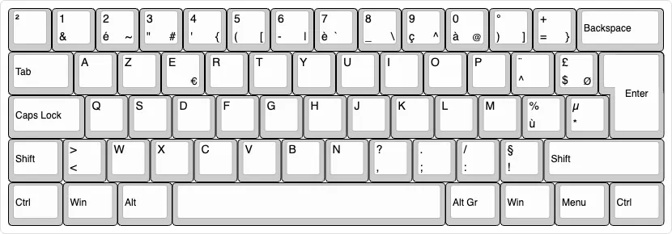
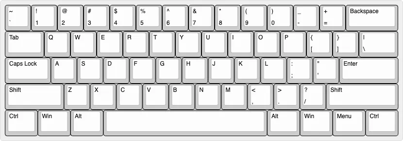
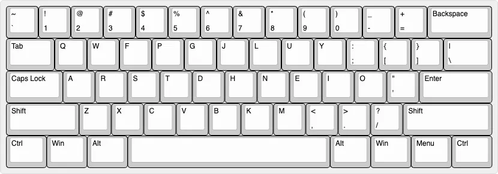
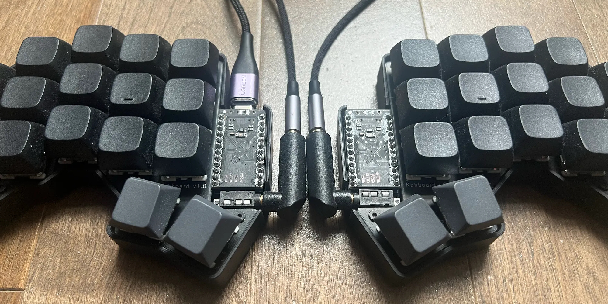
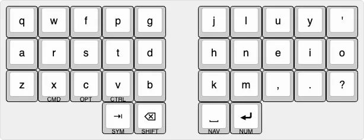
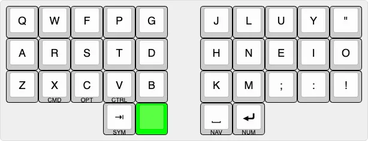
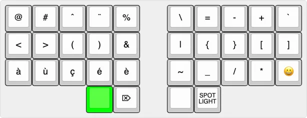
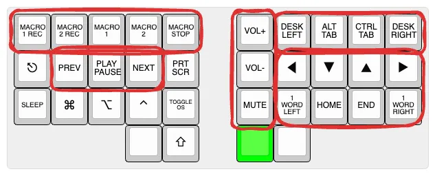
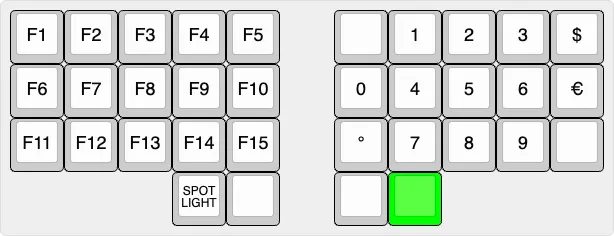
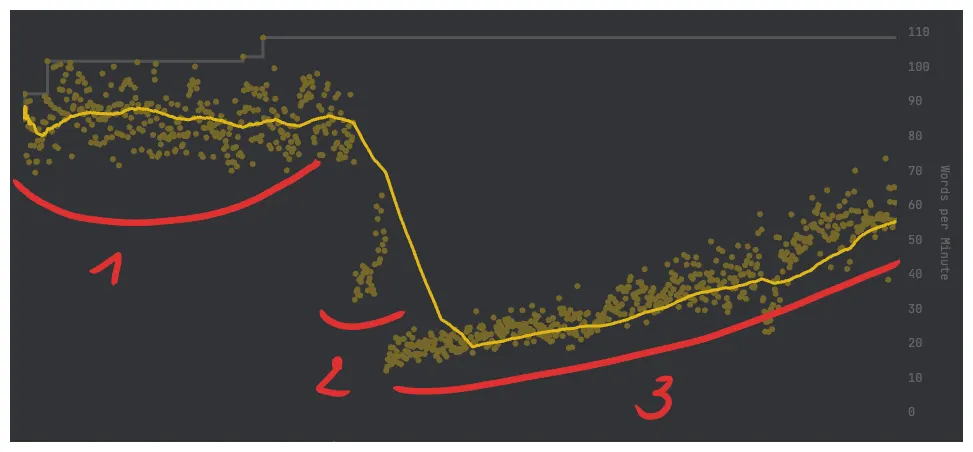

Hey,

I'm a software engineer, which basically means I spend a stupid amount of my life on a keyboard.

For years, I used French AZERTY because that was just the default around me. France, work laptops, my wife's laptop, colleagues' keyboards, all of it. The switch came from accumulated friction, not injury or productivity cosplay.

I switched because after 8 to 10 hours a day typing code, the whole thing started to feel absurd.

When you spend your days in TypeScript and Vue, your life is made of these characters:

```ts
const foo = items[i].bar?.baz ?? defaultValue;
```

On AZERTY, that code fights you constantly.

- `{` was `AltGr+4`
- `[` was `AltGr+5`
- numbers needed `Shift`
- `.` was `Shift+;`

These are core ingredients of writing code. So after enough years of this, I stopped thinking, "this is mildly inconvenient," and started thinking, **why the hell is my main tool designed like this?**

That question sent me down a rabbit hole:

> AZERTY → QWERTY → Colemak → custom split keyboard → back to QWERTY.

Yes, I went full keyboard goblin.



## Why AZERTY finally got on my nerves

AZERTY does have one massive advantage: it is the default. Keyboard nerds underestimate that.

- My environment already used it
- French writing worked fine on it
- I could sit at almost any nearby laptop and just go

But for programming, it felt like a layout designed by people who had never seen a code editor.

Some of the annoyances were small on paper, but brutal in repetition:

- the dot was awkward
- brackets were annoying
- numbers were needlessly harder than they should be
- backspace was still a pinky expedition
- one thumb did basically nothing except hit space

And then there was the Mac/Windows nonsense.

At the time I was living in Canada, working fully remote, using a personal MacBook Pro M1 and a work HP laptop. On Mac I used my thumb for `Cmd`. On Windows I used my pinky for `Ctrl`.

That sounds minor until you switch machines all the time and your hand suddenly forgets how to copy and paste.

It was death by a thousand stupid little frictions.

## First fix: learn to type properly

Before switching layouts, I first did the obvious thing I had ignored for too long: I learned touch typing properly on AZERTY.

That started in January 2023.

I was around 50 WPM at the beginning and eventually got to about 80 WPM. I could already type decently.

That almost made the next realization worse.

Because once I knew how to type properly, the layout's flaws became even more obvious. I was feeling every stupid design choice clearly.

## QWERTY: the practical rebellion

So in May 2023, I switched to US QWERTY.

This was the first real relief.



QWERTY immediately improved the stuff that actually bothered me at work:

- numbers made sense
- the dot was where a sane person would expect it
- brackets were easier
- symbols felt more logical
- Mac and Windows matched better

There was also a side benefit people underestimate: if you like mechanical keyboards, QWERTY is the civilized world. More options, more keycaps, more everything.

But QWERTY was still only a partial fix.

The letter layout was still weird. Backspace was still far away. My thumbs were still underused. My wrists were still on one flat slab. There was still no column stagger. So even though QWERTY was clearly better for me than AZERTY, I could already feel the next bad idea loading.

Also, because my MacBook was originally AZERTY, I ended up ordering QWERTY keycaps and replacing them. Since the laptop was ISO and the keycaps were basically ANSI, the result was this weird hybrid QWERTY-on-ISO compromise.

## Then I got greedy and switched to Colemak

At the end of May 2023, I switched again. This time to Colemak.



Colemak was the first layout that felt like someone had actually tried to think.

The most used letters were in better places. A lot of common shortcuts still stayed close enough to the muscle memory I already had. It improved typing without going full chaos mode.

Instead of learning Colemak first on a normal keyboard, I did the more ridiculous version: I started Colemak directly on `Kahboard`. What is `Kahboard`, you ask? More on that later.

In theory, combining the new layout with the new keyboard made sense. One painful transition instead of two.

In practice, the beginning was brutal.

I dropped to around **15 WPM** on the split keyboard.

And 15 WPM is not "a bit slower." It is humiliation with a keyboard attached.

I had stacked two relearning curves on top of each other: a new letter layout and a new physical keyboard.

I remember sitting at my desk in Canada trying to type a simple sentence, or a simple line of code, and after maybe 30 seconds it hit me how ridiculous it was. I was hunting for every key.

_I was stumbling through typing again from scratch._

That phase was miserable. Demoralizing. I could not even find the keys.

But it also turned into a challenge.

I wanted to know if I was actually capable of doing it.

So I did not recklessly switch everything at once. I trained on the side first. Once I got back to around 50 WPM, which was my original usable speed, I started using Colemak for work.

From there:

- about half a month to go from 15 WPM to 50 WPM
- about six months to climb back to around 80 WPM

Colemak felt better than QWERTY, and it felt earned.

## And then even Colemak was not enough

This is where the story stops being about layouts and starts becoming a proper obsession.

Colemak fixed the letters. It did **not** fix the keyboard.

I still wanted:

- backspace under the thumb
- better use of both thumbs
- less finger travel
- less wrist bending
- keys arranged around actual finger movement

Which is how I ended up falling into split keyboards.

What started as "I should improve my typing" slowly became "I should probably design my own keyboard now," which is an insane sentence but here we are.

## Building Kahboard

Around the same period, I started building my own split keyboard, using the [Ferris](https://github.com/davidphilipbarr/sweep) as a base for inspiration.

I designed the PCB, ordered it from [JLCPCB](https://jlcpcb.com/), bought the parts on [AliExpress](https://fr.aliexpress.com/), soldered the board, wrote the firmware in [QMK](https://qmk.fm/), and designed the case in 3D.

By June or July 2023, it became my daily keyboard.

I called it `Kahboard` because if you are going to disappear into a niche project this hard, you may as well put your name on it.

> Kahlouche + Keyboard = Kahboard



Seeing `Kahboard` printed on the PCB made it feel real in a way CAD files and firmware never do.

That was probably the most satisfying part of the whole thing.

Because it meant I had made something real.

### The Hard Part Was PCB Design

Soldering was fine. Debugging was fine. [QMK](https://qmk.fm/) felt close enough to my day job that it was almost relaxing. 3D design was already familiar territory because I was already into that stuff.

PCB design was the mountain.

I had never used [KiCad](https://www.kicad.org/). Never designed a PCB. Never dealt with layers, vias, and the ATmega32U4 side of things in any way.

The hard part was making it work **while keeping the board reversible and still making it look good**.

That is the part keyboard nerds do not always mention. Once you can technically route something, your brain immediately upgrades the problem to: yes, but can I route it cleanly, symmetrically, elegantly?

So naturally I made life harder for myself.

Worth it.

Also, the first board basically worked on the first try, which felt illegal. The only real issue was that I had placed the ATmega32U4 too close to the surrounding circuit and the USB port was shorting something. The fix was just giving it more space.

That is about as close to a miracle as first-time hardware gets.

### What it cost

I did keep rough numbers:

- 2 PCBs: `$6`
- 2 switch plates: `$7.5`
- 2 cases: `$10.5`
- 34 Holy Panda switches: `$6.5`
- 4 Tilted keycaps for the thumbs: `$3`
- 30 XDA PBT blank keycaps: `$11.5`
- 2 Pro Micro USB-C boards (ATmega32U4): `$16`
- 1 TRS-to-TRS cable: `$7.5`
- 2 Right-angle TRS adapters: `$2`
- 1 Magnetic USB-C cable: `$5`
- 34 Hot-swap sockets: `$4`
- screws, spacers, feet, and TRS port: `$1.5`

**TOTAL**: `~$80`

Also, some parts had to be ordered in bulk, so the total looks lower than the real story. I still have a bunch of spare parts now.

## Why Kahboard felt so good

The first month was interesting because some things felt amazing immediately, while others took time.

The instant wins were obvious:

- **Backspace under the thumb** was god tier from day one
- **Brackets on the home row** were god tier from day one
- **Enter under the thumb** felt immediately right
- **Fewer keys** felt weirdly freeing
- **Column stagger** made physical sense instantly

That last point matters more than it sounds. A normal keyboard is such a deeply accepted object that people stop questioning whether the rows even make sense for actual hands.

Then there were the blank keycaps.

People kept asking me: _How do you remember this character?_

Fair question.

But blank keycaps had a real purpose. They removed the option to cheat. The temptation to look at the keyboard is huge when you are relearning a layout. Blank caps forced commitment.

About a month in, once the speed started catching back up, the whole thing clicked emotionally too. That is when `Kahboard` stopped being a cool experiment and became my actual keyboard.

## The layout itself

This article is more about the journey than a full technical teardown, but here is the shape of the thing.

The layout had five layers, activated by holds. `Shift` gives you uppercase; these holds gave me whole alternate layers.

### Base layer



- Colemak letter base
- semicolon and slash swapped for apostrophe and question mark
- left thumb: tab and backspace
- right thumb: space and enter

### Majuscule layer



I liked pairing complementary characters together instead of scattering them randomly. For example, `;` was paired with `,`, `:` with `.`, and `!` with `?`. To me, it made more sense to access those on the Shift layer.

### Symbols layer



This layer got the most love because this was where the original AZERTY frustration had started.

- brackets grouped on the home row
- accents grouped together because I still write a lot in French
- delete, Spotlight, emoji picker
- `&` and `|` kept close because they belong together

### Navigation layer



This one grouped movement, media, sound, and window management into clusters that made sense to me.

And yes, I added macros in QMK.

And no, I basically never used them.

Classic.

### Numbers layer



Numbers were arranged numpad-style because that just feels correct.

## The Tradeoffs

I loved `Kahboard`, and it had real tradeoffs.

- non-standard layouts make other people's keyboards more annoying
- Colemak meant losing the normal tactile bump alignment at first
- Colemak on iOS is basically a joke, and custom keyboards on iPhone are trash
- the board was so tiny it could tip downward if I hammered outer keys with my pinky
- cables are annoying
- specialized setups create dependence

That last one became the important one.

At a desk, in a stable environment, `Kahboard` was incredible.

But the moment your life gets less stable, the whole philosophy gets stress-tested.

## The graph looked great, but life had other ideas

My [Monkeytype](https://monkeytype.com/) history tells a pretty neat story:



1. AZERTY
2. QWERTY
3. Colemak on `Kahboard`

By the end of the Colemak phase, I had climbed back to around **80 WPM**.

So if you stopped the story there, it would read as a classic optimization success story. Nerd gets obsessed. Nerd builds ridiculous custom thing. Ridiculous custom thing wins.

Nice ending.

Wrong ending.

## Australia killed the fantasy in the best possible way

Later, during a 10-month road trip around Australia, I was living in a motorhome with my family.

That changed the whole equation.

If it had been just a month, I probably would not have asked myself any of these questions that seriously. But 10 months is long enough for your setup to stop being a fun exception and start being your actual life.

There was no proper desk. The table was tiny. There was no room for a mouse, no room for an external split keyboard, no room for the full little ergonomic kingdom.

So I ended up mostly sitting on the bed at the back of the motorhome with just the laptop, still trying to learn things, still trying to stay sharp, still doing personal projects, still messing with all the usual software-engineer side quests.

And in that setup, the truth became very simple:

> Freedom matters more than comfort.

That was the moment the whole keyboard journey flipped in my head.

Because suddenly the best keyboard was not the one that felt best in perfect conditions.

The best keyboard was the one that let me operate anywhere.

That meant going back to laptop QWERTY.

Because it was available.

Because it was standard.

Because I did not want my effectiveness to depend on a very specific environment anymore.

So I trained QWERTY again. Now I am around **80 WPM** on the laptop, and more importantly, I feel at peace with it.

## Sharpen the tool vs sharpen yourself

This is the real point of the whole story.

I started this journey trying to sharpen the tool.

And for a while, that was absolutely the right move. I learned touch typing. I learned what annoyed me. I learned what actually matters to me in a keyboard. I learned enough electronics, firmware, PCB design, and 3D modeling to build something of my own.

That matters.

`Kahboard` was worth it.

It taught me a ton. It gave me a real opinion instead of borrowed keyboard opinions. It gave me confidence that I can walk into a domain I do not understand yet and still figure it out.

In that sense, the project worked even better than I expected.

But the final lesson was this:

> At some point, you need to stop optimizing the tool and start optimizing yourself.

That is where I am now.

I still think split keyboards are great. I still think Colemak is smarter than QWERTY in a bunch of ways. I can still imagine a better `Kahboard` too. Low-profile switches. Better support. Bluetooth. No cables. The temptation is still there.

But I know where that road goes.

And right now, I would rather be good with standard tools than dependent on specialized ones.

That is why the story ends here:

**Kahboard was worth it, but I now choose QWERTY for freedom.**

Because the experiment succeeded so hard it taught me something bigger than keyboards.

## Links

- [Keyboard Layout Editor](http://www.keyboard-layout-editor.com/)
- [Monkeytype](https://monkeytype.com/)
- [Kahboard on GitHub](https://github.com/antoinekahlouche/kahboard)
- [Home Row Mods](https://precondition.github.io/home-row-mods)
