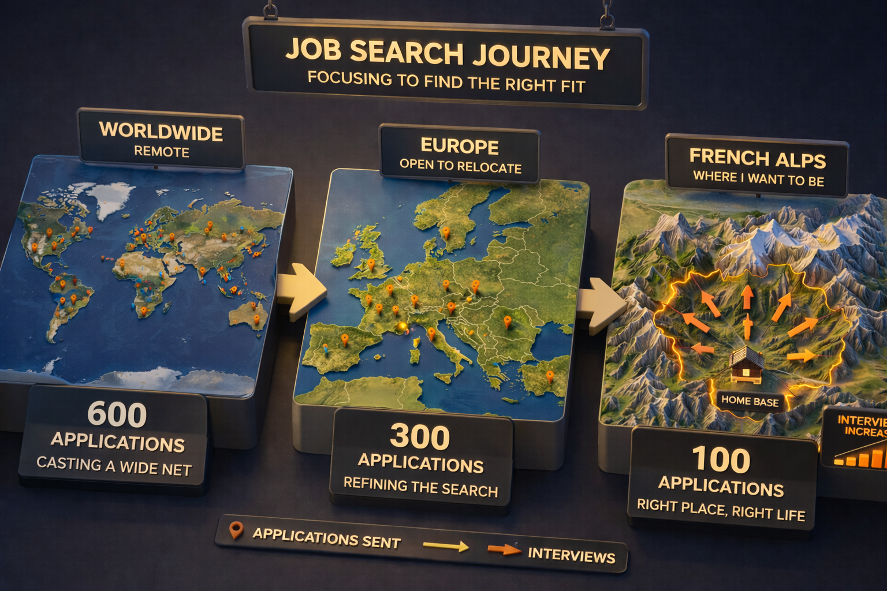

I entered the market in June 2025 after a year out during a family road trip around Australia.

It took me around **1,000 applications** to land my next job as a senior software engineer.

I have 14 years of experience. I worked backend and frontend. Big teams and smaller ones. Full-time and freelance. IC and tech lead. Onsite and fully remote. I speak French and English.

On paper, I had real strengths.

I also had real weak points: I was coming back after a year out, I had a broad profile instead of a neat specialist label, and I was entering a market that felt meaner than it looked from the outside.

## The Fork: Australia or the Safe Option

I left my previous job in July 2024 as a contractor.

The original plan was to keep building from that client relationship and relocate to Australia through it. The process was close to done.

Then global management killed it by deciding they would stop signing full-remote contracts.

The choice became simple and brutal: return to the office in France, or go to Australia anyway.

We chose Australia.

We did it for our kids to discover a new place, learn English, and build lifelong family memories.

At the fork we said: **"YOLO. You only live once. Let's go."**

It felt like a call to adventure, backed by confidence and runway.

Adventure every day of the week. That's our family DNA.

I still think that choice was right. Strong yes. No hesitation there.

What I underestimated was the price of coming back into the market after that break.

## Three Waves, Three Different Fights

I did not run one job search. I ran three.

### Wave 1: Global Remote, Full Fantasy Mode

From June 2025 to late August 2025, I went after full remote jobs worldwide.

That was the dream version. Best jobs. Maximum freedom. Broadest market.

It was also the worst conversion.

- Around **600 applications**
- Mostly through LinkedIn, [Remote OK](https://remoteok.com/), and similar remote-job platforms
- A few resume screens, HR calls, and tech tests
- Mostly ghosting and early rejections

By the end of that first wave, my confidence was at its lowest.

The process grinds you down in a stupid way. You keep throwing energy into a machine that mostly returns silence.

The real risk wasn't money. We had runway. The real fear was uglier:

> Will I ever find another job in tech?

That fear hit hardest at the end of wave one, while I was also selling the motorhome in Australia and preparing to leave.

There wasn't one dramatic collapse scene. It was more chronic than cinematic. Loss of hope. Physical fatigue. Short temper. Brain fog.

I was applying on autopilot.

### Wave 2: Europe and France, Closer but Sharper

After a reset in Japan, I started again in October 2025, back in France and organizing our wedding on top of everything else.

This time the target was Europe and France. More grounded. More practical. Still mostly TypeScript roles.

- Around **300 applications**
- LinkedIn still number one
- [Welcome to the Jungle](https://www.welcometothejungle.com/fr) close behind
- More traction than wave one
- Three final-round processes
- Three rejections right before the finish line

This was a different kind of pain. In wave one, you mostly get ignored. In wave two, you get close enough to smell the offer and then get told three different versions of "not you."

The feedback was almost funny in how contradictory it looked from the outside:

- "Not technical enough"
- "Not manager enough"
- "Not sure about your profile"

One company in Ireland wanted a very technical senior TypeScript engineer for a newly created team. I reached the last stage and got stopped with the feedback that I was not technical enough.

The weird part is that I actually felt off in that process the whole time. Especially in coding rounds. The questions were very precise, very niche, very framework-detail heavy. I was answering from broader engineering understanding, and I could feel the mismatch. We were not moving at the same speed.

Another company in France was hiring for a Tech Lead role. They told me I was not manager enough.

That one, honestly, felt fair.

My previous Tech Lead experience was mostly technical ownership. I was clear about that. I did not pretend I had already done full people and career management when I had not. They picked someone who had. Fine.

The Portugal process was more annoying because it was vague. Previous rounds had gone well. Final interview, the chemistry dropped. My read is simple: they wanted a stronger show of passion for *their* company, and I did not perform that part well enough. By the last rounds, some interviews stop being about engineering and start becoming theater.

### Wave 3: The Alps, Less Ego, Better Results

In January 2026, I changed the game.

I stopped optimizing for the perfect remote role in the perfect stack.

I optimized for a place I wanted to live.

The target became the French Alps.

- Around **100 applications**
- Hard geographic filter
- I read every offer manually
- I applied to almost anything with some coding inside it
- Language, remote setup, salary, and even title became more flexible

This was the most pragmatic phase of the search, and it got the best result.

The Alps pool was small. Sometimes **0 to 5 relevant postings a day**. Mostly hybrid. I stopped trying to win on paper and focused on one thing: get back in the game and live in the mountains.

That phase produced the two offers that actually put me back on my feet.

I had applied mostly to TypeScript roles during the whole journey.

I got hired for a **Python** role with no prior professional Python experience.

That alone should tell you how weird and non-linear this whole thing is.

## What the Search Actually Felt Like

If one number defines this journey, it's **1,000 applications**.

If one hidden number defines it, it's probably the time.

On heavy weeks, this was a **60h+ effort**.

Applying was only one part of it. I was also sourcing, reading offers, filtering nonsense, prepping interviews, following up, rewriting positioning, tweaking CVs, practicing [LeetCode](https://leetcode.com/), and checking LinkedIn compulsively.

The time per application ranged from around 5 minutes for easy-apply cases to 30 minutes for roles with custom questions or a cover letter. And that still ignores the time spent just finding decent opportunities.

The waiting was almost as bad as the interviews.

- Best case: around **24 hours** between rounds
- Worst case: around **1 month**
- Longest silence before rejection: around **2 months**

Those waiting periods eat your head in a special way. You replay answers. You invent signals. You negotiate with yourself. Every calendar notification starts carrying too much weight.

Publicly, I downplayed it.

Out loud I said: *"It's hard, but I'll find something."*

Privately, it was heavier than that. Most people had no idea I had applied to around 1,000 jobs. My wife saw the full weight of it.

She was the GOAT through the whole process. She did not just support me emotionally, she helped me triage the offers, read where my head was before I said anything, and kept me steady when the search was grinding me down. That mattered a lot.

## The Anecdotes, Because Abstract Complaints Are Too Nice

Here is a small museum of modern hiring.

### The Motorhome Interview

At one point in Australia, I had a third-round technical interview with a Japanese company.

I was living in a motorhome.

So I found a library and asked if I could use a small open room just outside it for the interview. I told them up front that I already knew the library would close before the meeting ended. I specifically asked them to check two things: whether I could stay there after closing, and whether the Wi-Fi would keep working. They said yes.

Mid-interview, security kicked me out.

Then the Wi-Fi died.

The interviewer was kind. Very kind, actually. He offered to postpone.

The next day, HR rejected me for fairness to the other candidates.

I understand the policy. But that one was hard to swallow.

### The Corporate Propaganda Homework

A company from Brittany approached me.

I had done my homework on them, but I went into the interview assuming they would explain the project. During the call, I realized they had expected me to watch a **one-hour corporate YouTube video** beforehand. Nobody had told me that.

I had still done my homework, and I had even used [NotebookLM](https://notebooklm.google.com/) to summarize the video.

The interviewer got aggressive and said, *"I don't have time to explain all of that to every candidate."*

My answer was simple: I do not have time to watch one hour of corporate video for every company I interview with.

### The Recruiter Who Promised He Was Different

At some point, a recruiter told me, basically, *we do not do business like that*.

The implication was clear: other recruiters were flaky, but not him. He was serious. Professional. Better.

I sent the CV.

He ghosted too.

Respect the classics.

### The Surprise Java Trap

I entered one process for a **Senior Frontend Engineer** role.

The HR round went well. Then, in the technical interview, they suddenly emphasized that they had many Java clients and started probing my Java proficiency.

I answered honestly: I know Java, but I had not used it in something like ten years.

Suddenly the conversation shifted from senior to mid-level.

That kind of mid-process downgrade is trash behavior. If Java was central, say it clearly upfront.

### The "Realistic" Free Labor Test

One company wanted me to spend **one to two full unpaid days** on a take-home test based on their real codebase.

It was presented as normal. Realistic. The best reflection of the work.

No thanks.

There is a point where "assessment" becomes asymmetric free labor, especially when the scope is huge and the expectations are blurry.

To make it better, the tech lead already seemed not very knowledgeable. That did not exactly inspire trust.

I refused the process.

## What I Think the Market Actually Revealed

The main thing this search burned into my head is simple:

> In interviews I was still the same engineer, but the person across the table changed everything.

Some people were impressed. Some were curious. Some treated the same profile as ordinary. My knowledge did not radically change during the search. The evaluation did.

This post is not me pretending I discovered The Truth About The Market. It is one person's data. One war story. But it is a real one.

That matters because when you are deep in a long search, it is easy to believe every rejection is a complete diagnosis of your worth.

It isn't.

Sometimes a rejection is fair and precise. Like the Tech Lead role where I lacked the management track record they wanted.

Sometimes it is about a very narrow expectation inside a stack.

Sometimes it is chemistry.

Sometimes it is timing.

Sometimes it is just that another person is looking for a different shape than yours.

I came out of this with a stronger belief that **problem-solving and engineering judgment matter more than one specific language**.

I also came out thinking TypeScript roles felt crowded as hell.

That is not a universal law. It is just my sample. But in my final-round processes, TypeScript tracks did not become offers, while offers came from elsewhere.

I applied to maybe **95% TypeScript roles** and got hired for Python.

That is either a joke or a lesson. Probably both.

Another pattern from my journey: later-stage momentum came from direct end-clients, not intermediaries.

Again, I am not turning one person's sample into a religion. I am just reporting what happened.

## The CV Stuff Mattered Less Than People Think

I changed my CV many times.

I changed the framing. I changed the ordering. I changed the amount of detail. I tried different ways of explaining my background, my skills, and my weirdly broad profile.

No single change clearly improved outcomes.

The only thing that felt consistently useful was localization.

My worldwide CV was not the same as my Europe CV. My Europe CV was not the same as my France CV. The French version was shorter. The more international versions were more detailed.

That mattered more than hunting for some magic sentence.

## Why the Startup Won

By mid-March 2026, I had two serious offers on the table.

One was a big company in an English-speaking environment, working in Java.

The other was a small startup, working in Python, focused on data, with a lot more ownership.

I spent two or three days discussing the offers with my wife.

The deciding sentence in my head was simple: **autonomy, remote work, and a new stack.**

I chose the small startup over the bigger Java company.

Victory wasn't just getting hired.

Victory was choosing a job that matched my career-evolution expectations.

For me, evolution means learning Python and having enough autonomy to put things in place and grow.

The bigger company had good salary, security, and benefits. But it was a path I had already lived before.

I did not want familiar comfort. I wanted forward motion.

## The Strange Relief of Going Back to Work

One of the weirdest parts of this whole story is that starting the new job felt lighter than job hunting.

Much lighter.

No constant need to prove myself every minute. No endless performance theater. No pressure to decode what this exact interviewer wanted to hear.

In week one, they simply gave me time to get up to speed.

My first tasks were not flashy. I updated documentation and a DB dump script because parts of onboarding were outdated.

Perfect.

It felt good to be back doing real work instead of auditioning for permission to do real work.

## What I Would Tell Other Engineers

Not guru advice. Just scars.

### 1. Treat it as a long game

If you enter the market assuming it will be quick, the process can punch you in the mouth early.

I would rather be pleasantly surprised than mentally built around a fantasy timeline.

### 2. Take breaks before burnout takes the wheel

No fixed schedule. Different people break at different speeds.

But if you feel the beginning of depression, stop and reset.

For me, the warning signs were clear:

- I could not step back and see the big picture
- I could not think clearly
- My whole life started revolving around the search

Japan was refreshing. I needed that break.

### 3. Protect your life outside the search

Spend real time with your partner. Play with your kids. Go outside. Keep something alive that is not the job hunt.

Otherwise the process starts eating your identity.

### 4. If you are junior and suffering, you are not weak

I had experience. I had runway. And it was still hard.

So if you are earlier in your career and getting smashed by this market, you are not alone. I am with you, and I hope you get your shot soon.

I hope you get lucky too.

This is easier advice to give when money is not tight. I know that. Financial pressure changes the game and makes clean mental-health rules harder to follow.

## The Ending I Actually Wanted

Now we are living it: mountains, hikes, new city, new job, new tech, new school for the kids.

The first sign we made the right call was simple: our new apartment is bright and calm, like a cocoon after a year in a motorhome and months of job-search battle.

I am not trying to change anyone with this story.

I am saying something simpler.

I may not be one-of-a-kind, but I am solid at my craft. I went to war, stayed on an uncertain path, and came out stronger.

Leaving everything for adventure was worth it. After a long fight, I still found the life and job I wanted.

**Have faith in the future, always.**
