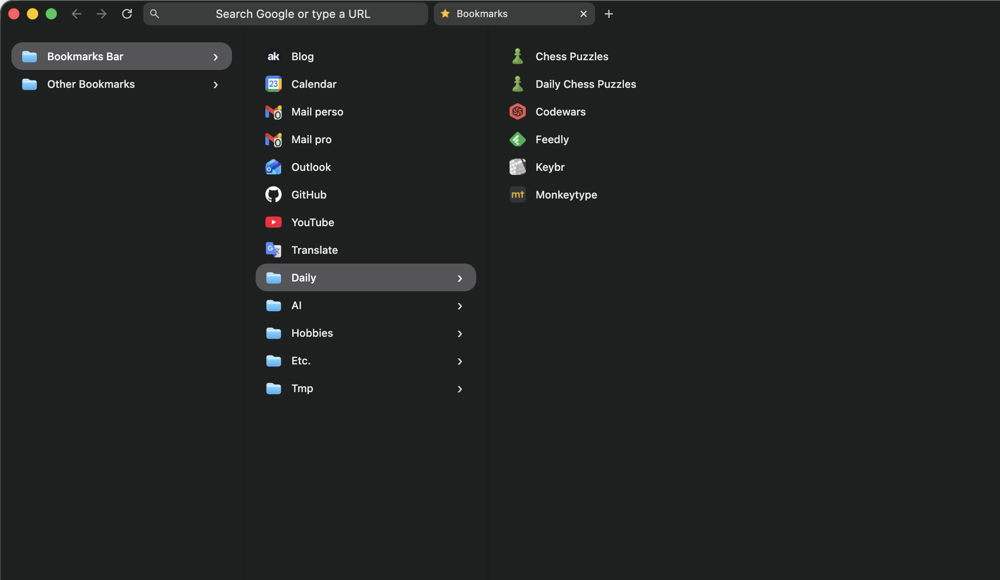

This is a small story about how I built a Chrome extension to put my bookmarks on the New Tab page.

I vibe coded it, and I think it is exactly the small project that is perfect for vibe coding.

I built it because my browser was taking too much space. Chrome was basically living on three horizontal layers:

- tab bar
- URL bar
- bookmarks bar

That is a stupid amount of permanent UI for something I use all day.

The annoying part was how normal it had become. A quiet annoyance that lasts for months.

> I am tired of applications taking half the screen just for menus.

Maybe [Neovim](https://neovim.io/) poisoned my brain a bit. After getting used to that low-chrome, no-menu feeling, a lot of mainstream software starts looking overdressed.

## Helium Solved Two Bars, Not Three

The first fix was [Helium](https://helium.computer/), which lets you merge the tab bar and URL bar into a single bar.

That immediately felt better.

But it also made the remaining bookmarks bar look even dumber. Once you remove two layers of browser clutter, the last one becomes the obvious design mistake.

I wanted to remove it completely.

The obvious answer would be: just hide it and toggle it when needed.

I hated that answer.

## The New Tab Page Is Where My Bookmarks Actually Belong

Then the obvious thing hit me.

My browser is usually on the New Tab page anyway.

I do not live in a pile of 42 open tabs. My pattern is usually this:

1. `Cmd+T`
2. Open what I need
3. Check the thing
4. Close the tab

So the New Tab page is the natural home screen of my browser.

That means it is also the right place for bookmarks.

Bookmarks belonged on the page that appears exactly when I need to launch something.

The interaction idea was simple:

- open a new tab
- see bookmarks immediately
- click folder, open a new column
- click bookmark, go there in the current tab

The visual inspiration was mostly macOS Finder column view. [Arc](https://arc.net/) maybe helped somewhere in the background because I already liked vertical bookmark navigation, but the real model was Finder.

## What The Extension Does

The extension replaces the New Tab page with a bookmark browser.

By default, the `Bookmark Bar` folder is open.

When I click a folder, it opens a new column to the right. When I click a bookmark, it opens in the current tab.

That tiny behavior change turned out to be enough.

It beats the old bookmarks bar for a few reasons:

- it gives me back one full line of browser chrome
- it matches the moment when I already decide where to go next
- it is faster than typing for some things
- it supports folder browsing instead of forcing recall
- it helps me rediscover links I forgot I had
- it lets me jump to specific deep links, not just homepages

Sometimes you do not want search. Sometimes you want a launchpad. On the New Tab page, I get both at the same time: the bookmarks and the URL bar.

## I Built It Like a Barbarian, Which Was Correct

I built this in mid-April 2026 with GPT-5.4 in [OpenCode](https://opencode.ai/).

Started from blank files.

First useful version took about 30 minutes.

It worked on the first try.

The funny part is that the first version worked technically, but looked awful.

That was the real bug.

I never looked at the code. I just concentrated on the behavior.

That sentence would be irresponsible in plenty of contexts. Here, it was exactly right.

This project was tiny, bounded, and easy to judge with my own eyes in about five seconds.

Either the interaction felt right, or it did not.

Either the New Tab page became the right home for bookmarks, or it did not.

There was not much room for fake progress.

## Why This Was Perfect for Vibe Coding

I think this is where a lot of the vibe coding discourse gets confused.

The value was that AI collapsed the distance between an idea and the moment where I could actually *use the thing*.

That matters because some product truths are only available through usage.

You cannot think your way all the way to them.

The assumption I wanted to test was very clear in my head:

> If my bookmarks lived on the New Tab page in a Finder-style column view, I could remove the bookmarks bar, reclaim vertical space, and make the browser fit the way I already think.

That assumption was fully true.

That is the real win.

AI gave me the freedom to test a product idea fast enough that I could stop theorizing and start using it.

For small personal tools, that is huge.

Especially when the domain is this simple. In the end, it is just links and folders. The hard part was not backend complexity or edge-case hell. It was deciding what shape the interaction should have.

Once that shape was clear, the rest was mostly execution.

## What I Learned After Actually Living With It

The biggest surprise is that there was no surprise.

I removed the bookmarks bar completely.

I still use the extension.

I have more vertical space.

The browser feels calmer. It fits my actual behavior better. And because I usually end up back on a New Tab page after closing things, the whole setup feels weirdly natural, like it was made for me.

Which, to be fair, it literally was.

That is also why I do not romanticize this build too much. Emotionally, the whole thing was pretty detached. It was just a tool. I solved something that bothered me.

That is enough.

## The Boundary Line

This worked because the project was small, well defined in my head, and well bounded.

If hidden complexity, money, security, correctness, data loss, or nasty edge cases enter the room, the method changes.

I will still use AI.

But I will read the code for sure.

For this project, though, the barbarian method was fine.

Better than fine, actually.

It let me go from mild irritation to a real working tool almost immediately, then judge the result where it matters: inside the actual flow of my day.

The extension is open source here: [antoinekahlouche/bookmark-finder](https://github.com/antoinekahlouche/bookmark-finder).

Small personal software is one of the most fun corners of computing.
