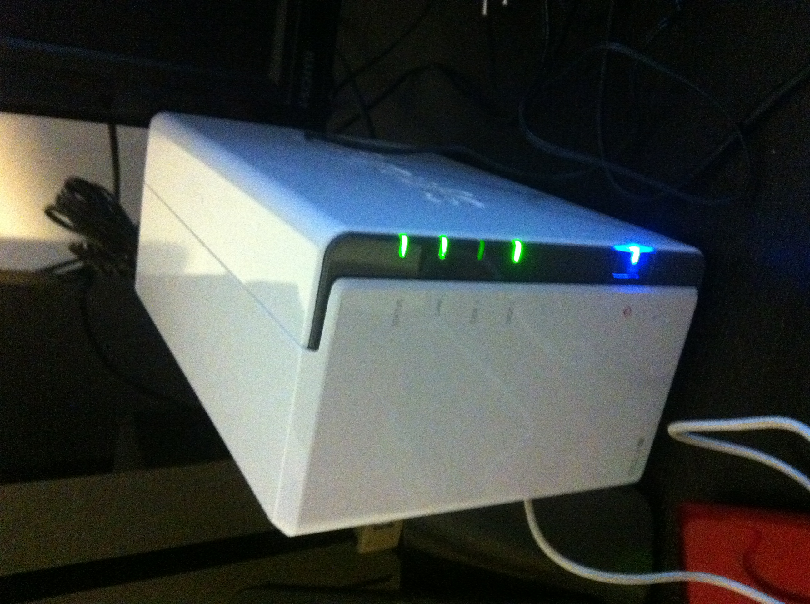
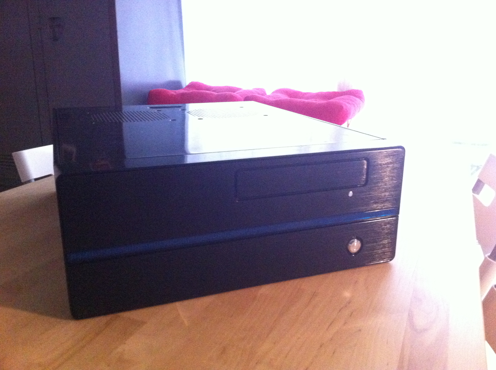
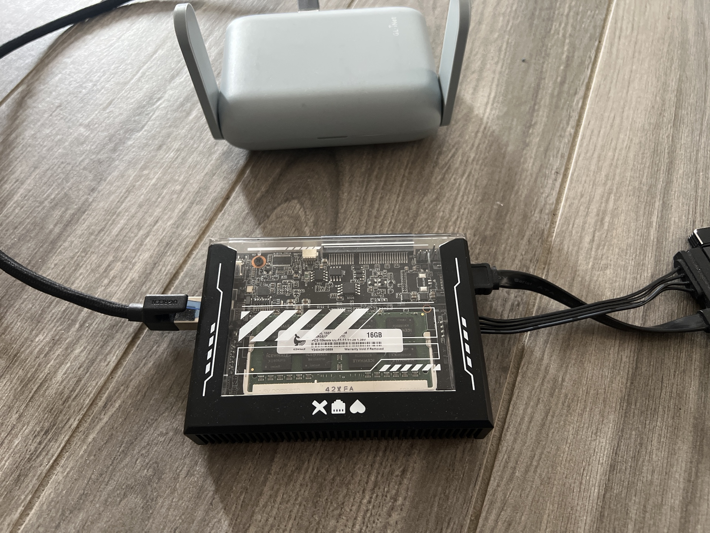
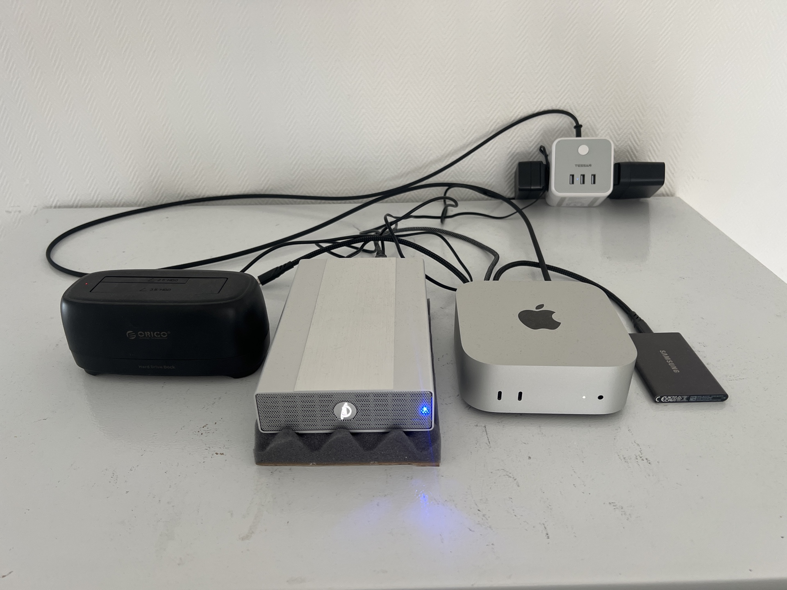

Careful: this article contains old photos.

My home server stopped being a toy when it started protecting my family's life.

There is a Mac mini in a closed room in my house.

Next to it, there is an SSD for Docker, an HDD for data, and an empty HDD dock that stays connected for monthly backups.

It runs Docker. It backs up continuously to [Backblaze](https://www.backblaze.com/). It shares files over Samba. I can remote into it with macOS Screen Sharing. [Tailscale](https://tailscale.com/) gives me private access from anywhere.

It took me twelve years to understand one thing.

A home server is not a toy first.

It is family infrastructure first. The playground comes after.

This was twelve years of trying things, getting annoyed, rebuilding, moving countries, changing plans, selling machines, backing up photos in public libraries, and eventually admitting what I needed.

## 2013: The Synology Beginning

My first home server was a Synology around 2013.

The motivation was simple: I wanted to try it. A NAS felt like the adult version of "I have files everywhere and this is stupid." Put the disks in the box, click through the interface, get something useful.

And for a while, that was enough.



That first period taught me something important: I needed a central place for photos and documents. This was a real need in my life. Pictures, scanned papers, administrative stuff, old files, media. The pile was already real.

But Synology also started to frustrate me.

The performance was weak. The price-to-performance ratio felt bad. Evolutivity was limited. The system felt closed and non-standard in ways that bothered me more over time.

Synology simplicity is tempting. I understand the appeal. I went back to it later, so clearly the appeal worked on me too.

## 2015: The Homemade PC Era

Around 2015, I left Synology and built a homemade home server.

It was a horizontal black case. It had an Xbox 360 controller. It was plugged into the TV. It had Steam. It had Molotov back when Molotov was useful for watching TV and movies. I played a lot of Spelunky and Portal 1 & 2 on that thing.



The appliance phase was over. This was a computer. My computer. I could build it, open it, change it, abuse it, and make it do whatever I wanted.

That felt good.

The server became more than a storage box. It became a media machine, a living room computer, and a playground for doing things myself. It had the mess and freedom of a proper PC.

It also introduced one piece that became non-negotiable for me: Backblaze.

Backblaze felt almost too good to be true. Continuous backup. Fixed price. Unlimited archive.

Over time I realized I wanted storage and recovery. I wanted a way back if the disk died, if a file vanished, if the house burned down, if everything got stolen.

## 2020: Back to Synology

Around 2020, I went back to Synology.


I wanted simplicity again. That is the trap, and I mean that with affection. After enough custom setup, the idea of a clean appliance becomes sexy again. Put disks in. Use web UI. Stop thinking.

My brain kept going.

The same limits came back.

I was paying for simplicity and still hitting walls.

The lesson was obvious and slightly humiliating.

I needed something more powerful and more open.

Apparently I needed to pay that lesson twice before it agreed to stay in my skull.

## 2023: The SFF PC Built for a Future That Changed

In 2023, I built another PC server, this time small form factor.


Same basic idea as the old homemade PC, but smaller and with more muscle. It ran Windows because I wanted games, Backblaze, and the practical stuff that came with that choice.

At that point, the plan was to settle in Australia. So the machine made sense. A compact server that could move with us, strong enough to do what I wanted, flexible enough to keep experimenting.

Then the plan changed. The new plan was a one-year motorhome road trip.

The machine was good. The new plan needed something smaller.

I had to sell it.

## 2024: A Zima Blade in Australian Libraries

For the road trip, I needed something smaller.

So I took a [Zima Blade](https://www.zimaboard.com/) and an HDD to Australia.

The mission was simple: keep the trip pictures safe.

Once a month, during the motorhome trip, I plugged the Zima Blade in at a public library. I used a [GL.iNet](https://www.gl-inet.com/) portable Wi-Fi router, connected the family iPhones, and ran the [Immich](https://immich.app/) backup.



It usually took 10 to 30 minutes, depending on how many photos we had taken.

The portable router handled Wi-Fi. Any wall outlet handled power.

If an iPhone got lost, stolen, destroyed, or bricked before the photos were copied, that chunk of the trip could disappear. And the thing I wanted to protect was bigger than one perfect photo. It was the thread of the adventure. The daily proof that this mad year was happening. The blurry shots, the good ones, the dumb ones, the kids, the landscapes, the road, the tiny moments you only care about because they are yours.

## 2025: The SMART Warning

When we came back to France, I retrieved two stored hard drives.

One of them showed SMART warnings. The message was basically: back up your data now or lose it.

That disk had documents and photos on it.

I bought another HDD, backed up the data, and moved on. Just that cold little moment when a drive that was sitting in storage suddenly becomes a problem.

That was the closest I came to actually losing data.

And that kind of stress is exactly what my current setup is designed to reduce.

A backup is a panic-reduction machine.

I want to see a dying disk warning and feel annoyed but calm.

## 2025: The Mac Mini Setup Clicked

In 2025, back in France, I bought a Mac mini M4.

That is the machine that finally made the family-infrastructure version click.

The reasons were simple:

- Apple Silicon performance per watt is excellent.
- The machine is quiet.
- Docker works.
- Backblaze Personal runs on macOS.
- Samba is there for file sharing.
- macOS Screen Sharing gives me easy remote desktop.
- Tailscale gives me private access from my devices.

My preferred server OS order is Linux, macOS, Windows.

But [Backblaze Personal](https://www.backblaze.com/cloud-backup/personal) runs on macOS, and the backup requirement wins.

That is the whole compromise. I can have ideological preferences, sure. I can also have 15+ years of family photos and around 2 TB of pictures and videos that I refuse to gamble with.

The current machine has an attached SSD for Docker and an attached HDD for documents and media. The empty HDD dock stays connected because the monthly backup ritual matters.



## What I Actually Needed

After all that, the list became pretty simple.

I needed one place for the family photos. One place for documents. Backups that actually run. Remote access that does not make me nervous. A machine my family can benefit from, even if they never care how it works.

I still like self-hosting. I still like trying apps, dashboards, file browsers, containers, and small weird tools. That part is fun.

But the server has a job now. It needs to protect the important everyday stuff first, and it can be a playground after that.

My data HDD has three main areas:

```text
/documents
/pictures
/medias
```

Each area carries a different risk.

`/documents` is painful to lose. Payslips, school history, blood tests, scans, random administrative junk. In theory, a lot of it is recoverable. In practice, "recoverable" means contacting ten different places.

`/pictures` is disastrous to lose. It is the family photo and video library: 15+ years, around 2 TB, all the memories we actually go back to.

`/medias` is the least dramatic. Movies, music, books, manga. Annoying to lose, but mostly replaceable.

The backup setup is closer to 4-2-1 than 3-2-1:

```text
1. Current data HDD
2. Monthly rsync 1-to-1 copy
3. Monthly BorgBackup versioned backup
4. Continuous Backblaze archive
```

The monthly ritual is simple. I take the backup HDDs stored in a box in a different room, somewhat hidden. I plug the rsync disk into the dock, run the script, and wait. When it finishes, I plug the [BorgBackup](https://www.borgbackup.org/) disk into the dock and run that script too.

The rsync disk gives me a direct copy.

Borg gives me history.

Backblaze gives me disaster recovery if the house burns down or everything is stolen. That recovery would be long. Fine. Long is acceptable. Gone is unacceptable.

## Private Remote Access

I want access from outside the house, but I want it simple and controlled.

I can open ports, set up a reverse proxy, deal with certificates, and harden services. I have done that kind of thing before. For this server, I prefer a smaller surface area and less maintenance.

So I use Tailscale.

It is installed on my devices. When I need the server, I connect and it feels like I am on the local network. I can manage the Mac, open services, move files, and check backups.

That is enough. Private access, no public drama.

## The Family Infrastructure Part

The final surprise is that the server became less about me.

The server runs a bunch of Docker services, but the emotional winners are obvious.

Immich is the big one.

My wife and I share the same Immich account, so all our photos are in one place. That alone is worth a lot. We can talk about a memory and immediately pull it up. The road trip, the kids, some old moment we half-remember, the kind of thing that would otherwise be buried under years of phone migrations and cloud-storage pressure.

It also keeps me out of the paid cloud storage treadmill. With 15+ years and around 2 TB of photos and videos, throwing everything into Google Photos or iCloud means paying forever. Paying for storage can be perfectly reasonable. I prefer this arrangement: local control, open source app, real backups behind it.

[Ubooquity](https://vaemendis.net/ubooquity/) is the one the kids actually feel.

Both kids read on their own on iPads.

Before that, they accessed books as PDFs on the server. It worked, but large PDFs on older iPads felt slow and clumsy. Ubooquity made it simple enough that the server disappeared from their point of view.

For them, it is just the app where the books are.

That is perfect.

[Navidrome](https://www.navidrome.org/) is where the old music lives.

Watching your kids discover old music from your own server is weirdly powerful. It brings back memories, then creates a new shared subject. Suddenly some old track becomes part of the house again.

The rest of the stack is useful too: [Homarr](https://homarr.dev/) for the app dashboard, a small vibe-coded nginx file explorer, [slskd](https://github.com/slskd/slskd) for music, [ConvertX](https://github.com/C4illin/ConvertX) for file conversion, qBittorrent for torrents, and [Gluetun](https://github.com/qdm12/gluetun) in front of qBittorrent and slskd.

The server crossed the line from hobby machine to family infrastructure.

## The Setup Fits the Life

The Mac mini setup still has compromises.

The data drive is still an HDD. I would prefer SSD-only storage because it would remove the last noise and mechanical compromise. But 8 TB SSDs are still expensive, and my life has better uses for that money right now.

So the HDD stays for now.

The important thing is that the urge to rebuild has calmed down. The gaming-on-the-server itch is quiet. The hardware experiment itch is quiet too, at least for now. It can always come back. I know myself well enough to keep my peace treaties with computers temporary.

But right now, the feeling is relief.

I found what I need.

The server stores the documents that make bureaucracy less painful.

It protects the photos that would be disastrous to lose.

It keeps media around. It gives my kids books and manga. It lets them discover old music. It gives me private remote access.

It backs up continuously and in layers.

That is enough.
