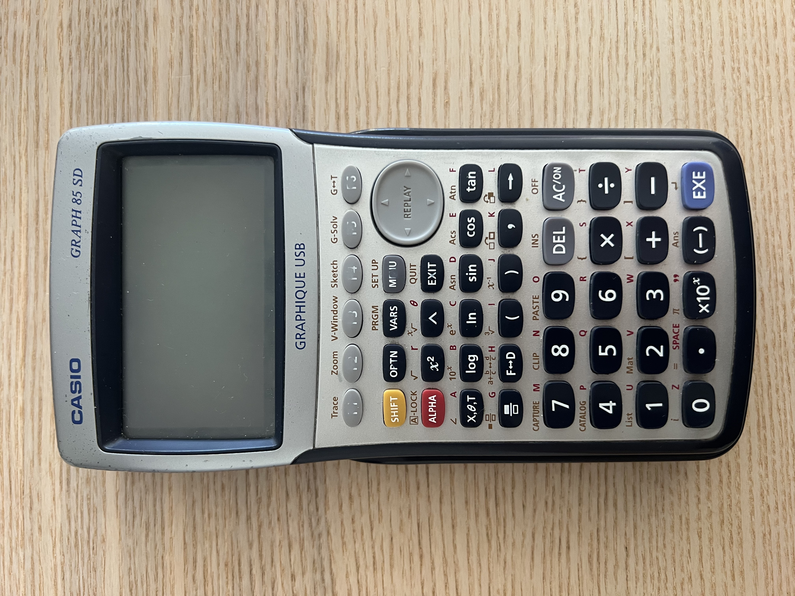

I started coding before I knew I wanted to code.

First with a Star Wars website. Then with games on a calculator.

At the time, it was just fun. Only later did I understand that I had already been drawn to it for years.

## A Star Wars Fan Site

I wrote my first code when I was 14.

It was a Star Wars fan site. I was deep into Star Wars at the time, so I made a website about it.

Movie scripts. Pictures. Posters.

Raw HTML. Raw CSS.

I did not buy a domain name. I used the URL Lycos gave me.

A friend of my parents helped me. Her name was Christelle. She mostly helped me understand Lycos hosting: how to put the site online, where files went, and how the whole thing worked.

That was my first exposure to frontend.

You wrote a page. You uploaded it. It existed on the internet.

That felt huge.

## More Websites Followed

After that, I built other websites.

The one I remember best is a [Dofus](https://www.dofus.com/) guild website.

It had members. Pictures. Guild rules. Guild objectives.

I was still mostly making pages. Putting things on screen. Organising content.

The next step came later.

## Calculator Code

At 16, I started coding on a [Casio Graph 85SD](https://www.casio.com/) during biology class.



I was bored. So I coded.

I was with Quentin, a friend who was also coding.

This felt different from making websites.

It was not about pages anymore. It was about logic.

Inputs. State. Rules. Movement. Conditions.

It was the closest thing I had to a terminal.

## Casio Basic Was Painful

We wrote in Casio Basic.

Writing code on a calculator is painful because a calculator is made to input numbers, not code.

The letters were in alphabetical order, not arranged like a normal keyboard. Special characters were even worse.

Every line took effort. Editing was slow. Debugging was worse.

But we kept doing it.

## Snake

We made many programs and games during that time.

Some of them were:

- **2 DEGREE**: calculated the solutions to a second-degree polynomial.
- **BASE**: converted a number into a new base.
- **CODE**: displayed a rotating code, as if the calculator was thinking like in the movies.
- **D6**: threw a six-sided die and displayed the result.
- **DE**: displayed statistics from D6 throws. The calculator threw the dice in a loop, and in the end the six possibilities should converge toward 0.167.
- **DIV EUCL**: calculated a Euclidean division.
- **EGAL 1**: randomly generated a number between 0 and 9. If it was not 1, it continued. If it was 1, it printed it and continued to 11, then 111, and so on.
- **FIBONACH**: calculated the Fibonacci sequence one number at a time.
- **I**: ran many dice throws, kept track of stats, and displayed the percentage of times 1 came out.
- **PGCD**: found the PGCD in math.
- **POINT**: randomly printed dots until the screen was completely black.
- **PREMIER**: told if the number you input was prime.
- **SNAKE1.0**: first version of Snake, with bugs.
- **SNAKE2.0**: the Snake I will show later in this article.
- **SNAKEC.N**: Snake with a screen to choose between arrows or 4862 to play.
- **TESTPRE**: IDK
- **VARIABLE**: displayed the value of each variable in the calculator.

The one I remember most is Snake.

On paper, Snake is not a complicated game.

On a Casio calculator, it was enough to make us think hard.

You had to move something on screen. Remember the direction. Place the next apple. Count how many apples had been eaten.

It was not the classic Snake where the body keeps growing forever. Our version reset after 10 apples.

The snake itself was infinite. The game was not about managing a longer and longer body. It was about keeping the loop alive.

This is the code:

```vb
Lbl 6
AxesOff
ClrGraph
ViewWindow 0,1,1,0,1,1
1
Int (126Ran# +1)→G
Int (62Ran# +1)→H
PxlChg H,G
60→B
30→A
1→C
0→D
0→F

Lbl 0
A+D→A
B+C→B

Lbl 1
H=A And G=B⇒Goto 2
H≠A Or G≠B⇒Goto 3
Lbl 2
PxlChg H,G
F+1→F

F=10 Or F=20 Or F=30 Or F=40 Or F=50 Or F=60 Or F=70 Or F=80 Or F=90⇒ClrGraph
Int (126Ran# +1)→G
Int (62Ran# +1)→H
PxlChg H,G
Lbl 3
PxlTest(A,B)→E
E=1⇒Goto 4

PxlOn A,B

B=127⇒2→B
B=1⇒127→B
A=63⇒2→A
A=1⇒63→A

Getkey=53⇒Goto A
Getkey=64⇒Goto B
Getkey=62⇒Goto C
Getkey=73⇒Goto D
Getkey=72⇒Goto E
Getkey=52⇒Goto F
Getkey=74⇒Goto G
Getkey=54⇒Goto H
Getkey=63⇒Goto I
Goto 0

Lbl A
1→C
0→D
Goto 0

Lbl B
0→C
-1→D
Goto 0

Lbl C
0→C
1→D
Goto 0

Lbl D
-1→C
0→D
Goto 0

Lbl E
-1→C
1→D
Goto 0

Lbl F
1→C
1→D
Goto 0

Lbl G
-1→C
-1→D
Goto 0

Lbl H
1→C
-1→D
Goto 0

Lbl I
0→C
0→D

Getkey=U⇒Goto A
Getkey=V⇒Goto B
Getkey=W⇒Goto C
Getkey=Z⇒Goto D
Getkey=72⇒Goto E
Getkey=52⇒Goto F
Getkey=74⇒Goto G
Getkey=54⇒Goto H
Goto I

Lbl 4
ClrText
"SCORE"
Locate 14,1,F
Goto 6
```

It was probably ugly. It was definitely slow.

But it worked.

That was the part I liked.

## Understanding It Later

I have good memories of this.

The Star Wars site. The Dofus guild site. The calculator games. The biology classes spent coding with Quentin.

But I still had to wait until I was 19 to understand that I wanted to code for a living.

Before that, I had no idea what I wanted to do.

That was a problem.

Then I chose to go to a coding university. Only then did it become obvious.

I had already been doing it for years.

I liked making things. I liked understanding systems. I liked taking an idea and forcing it into a form a computer could run.

The career came later.

The instinct was there first.
